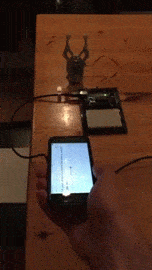

# robotic-claw
> Experiment with controlling a robotic claw with smartphone gyroscope

   
  

## Hardware
* [Robotic Claw - MKII](https://www.sparkfun.com/products/11524)
* [Arduino Uno](https://www.sparkfun.com/products/11021)
* [Servo - Generic Metal Gear (Micro Size)](https://www.sparkfun.com/products/10333)

## Setup

