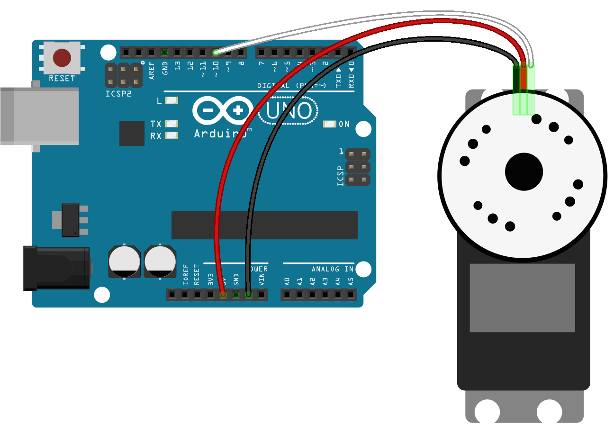

# robotic-claw
> Experiment with controlling a robotic claw with smartphone gyroscope

<p align="center">
  <br>
  <a href="https://www.youtube.com/watch?v=kPhcN7FCmFk">
    
  </a>
</p>

## Hardware
* [Robotic Claw - MKII](https://www.sparkfun.com/products/11524)
* [Arduino Uno](https://www.sparkfun.com/products/11021)
* [Servo - Generic Metal Gear (Micro Size)](https://www.sparkfun.com/products/10333)
* [USB Cable A to B](https://www.sparkfun.com/products/512)
* [3 X Jumper Wires Standard 7"](https://www.sparkfun.com/products/11026)

### Setting it up


## Install
Make sure you have Node.js and npm installed

```bash
$ git clone https://github.com/simon-johansson/robotic-claw.git && cd robotic-claw
$ npm install
```

## Starting the server
Connect the Arduino to the host machine and then, from the host, run
```bash
$ npm start
```
Open ``http://localhost:3000/instructions`` on the host machine and follow the instructions to controll the claw.

## License
MIT
